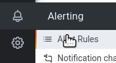
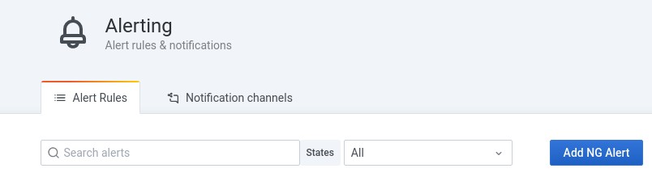
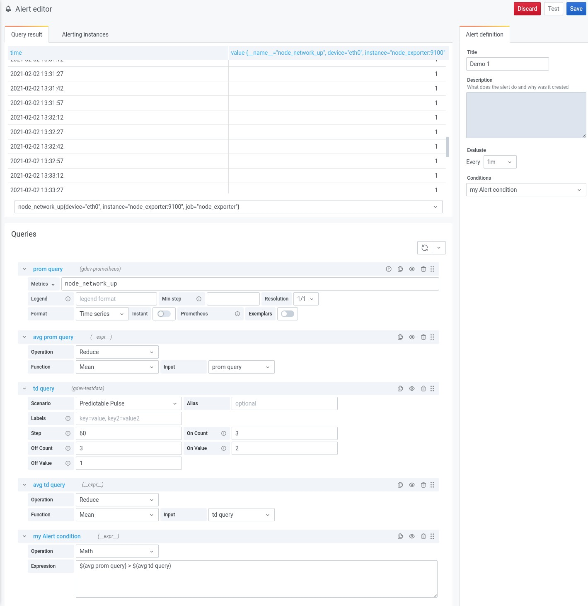
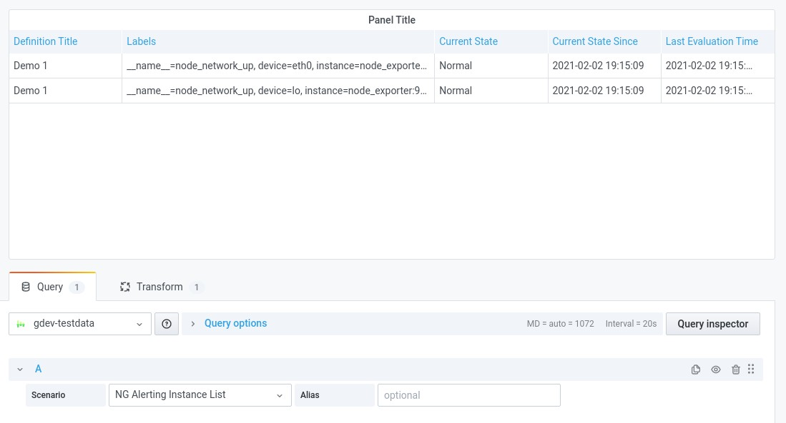
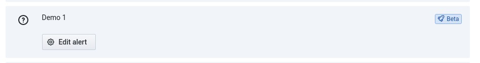
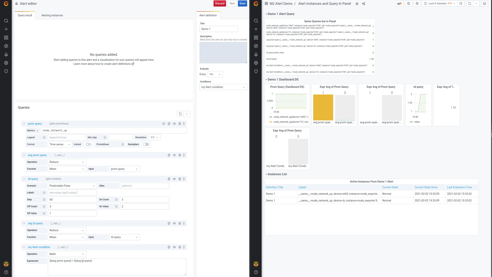
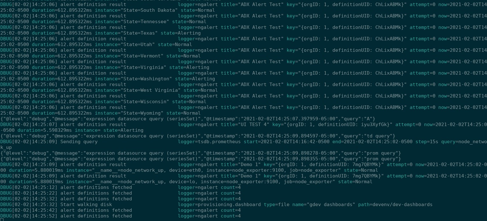

# Demo Backup for NG Alert

## Add An Alert and see Instances

(ngalert feature flag needs to be enabled)

1. Go to list of Alert rules

2. From the list view, create New NG Alert

3. Draw the owl, I mean, add queries and expressions, set the condition to a RefID/Query that returns labels numbers, name it, and hit save (test does not work from UI yet, but would show up in Alerting instances tab (Label, and True False)):

4. On a branch of mine, you can list alert instances being returned from the definition running in the background by Grafana's server scheduler (There is also a REST API for this):

5. You can go back and edit the alert from the list view

## Misc

Things API can do but UI Can't yet:
 - Testing of instances not saved (although that may be merged soon)
 - Pause / unpause alert definitions
 - Create queries with different time ranges, compare them with expressions

Alert Definition, and a Dashboard using a manual copy of the same queries:

Scheduler running alert definitions and creating instances (which are saved):

